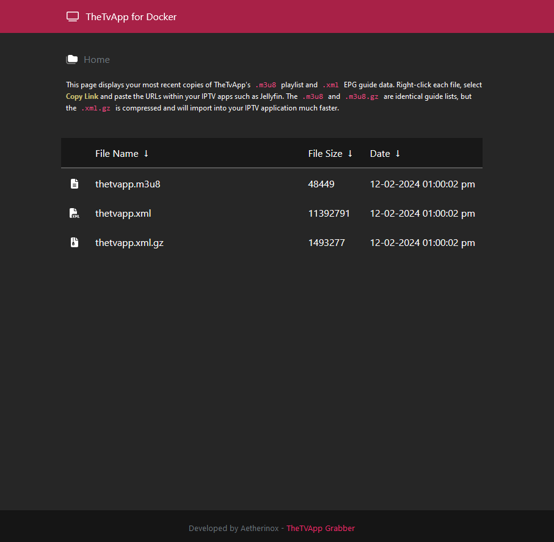

<div align="center">
<h6>Automatic m3u8 / xml grabber for TheTvApp</h6>
<h1>♾️ TheTvApp Automated Grabber ♾️</h1>

<br />

Docker image which automatically fetches the M3U playlist and EPG (XML) guide data for TheTvApp. Can be loaded into IPTV applications such as Jellyfin.

Makes use of the generous work over at [https://github.com/dtankdempse/thetvapp-m3u](https://github.com/dtankdempse/thetvapp-m3u)

</p>

<br />



<br />
<br />

</div>

<div align="center">

<!-- prettier-ignore-start -->
[![Version][github-version-img]][github-version-uri]
[![Downloads][github-downloads-img]][github-downloads-uri]
[![Size][github-size-img]][github-size-img]
[![Last Commit][github-commit-img]][github-commit-img]
[![Contributors][contribs-all-img]](#contributors-)

[](https://aetherinox.github.io/thetvapp-docker/)
<!-- prettier-ignore-end -->

</div>

<br />

---

<br />

- [About](#about)
- [Install](#install)
  - [Docker Compose](#docker-compose)
- [Contributors ✨](#contributors-)


<br />

---

<br />

## About
This container allows you to automatically fetch the latest `.m3u8` playlist, and `.xml` guide files for the TheTvApp IPTV service. 

Once the container is started up, an initial grab will be done immediately. After that initial grab, the container will periodically grab new copies of the files every X hours, which can be adjusted by modifying the docker environment variables.

The fetched .m3u8 and .xml files are then placed in a self-hosted nginx webserver which allows you to add the direct links directly into applications such as Jellyfin without having to go back and update the files on your own.

<br />

---

<br />

## Install
Instructions on using this container

<br />

### Docker Compose
Create a new `docker-compose.yml` with the following:

```yml
services:
    thetvapp:
        container_name: thetvapp
        image: thetvapp:latest
        restart: unless-stopped
        volumes:
            - ./thetvapp:/config
        environment:
            - PUID=${PUID:-1000}
            - PGID=${PGID:-1000}
            - TZ=${SERVER_TIMEZONE}
            - CRON_TIME=*/60 * * * *
```

<br />

---

<br />

## Contributors ✨
We are always looking for contributors. If you feel that you can provide something useful to Gistr, then we'd love to review your suggestion. Before submitting your contribution, please review the following resources:

- [Pull Request Procedure](.github/PULL_REQUEST_TEMPLATE.md)
- [Contributor Policy](CONTRIBUTING.md)

<br />

Want to help but can't write code?
- Review [active questions by our community](https://github.com/Aetherinox/thetvapp-docker/labels/help%20wanted) and answer the ones you know.

<br />

<div align="center">


</div>

<br />

The following people have helped get this project going:

<br />

<div align="center">

<!-- ALL-CONTRIBUTORS-BADGE:START - Do not remove or modify this section -->
[![Contributors][contribs-all-img]](#contributors-)
<!-- ALL-CONTRIBUTORS-BADGE:END -->

<!-- ALL-CONTRIBUTORS-LIST:START - Do not remove or modify this section -->
<!-- prettier-ignore-start -->
<!-- markdownlint-disable -->
<table>
  <tbody>
    <tr>
      <td align="center" valign="top"><a href="https://gitlab.com/Aetherinox"><br /><sub><b>Aetherinox</b></sub></a><br /><a href="https://github.com/Aetherinox/thetvapp-docker/commits?author=Aetherinox" title="Code">💻</a> <a href="#projectManagement-Aetherinox" title="Project Management">📆</a> <a href="#fundingFinding-Aetherinox" title="Funding Finding">🔍</a></td>
    </tr>
  </tbody>
</table>
</div>
<!-- markdownlint-restore -->
<!-- prettier-ignore-end -->
<!-- ALL-CONTRIBUTORS-LIST:END -->

<br />
<br />

<!-- prettier-ignore-start -->
<!-- markdownlint-disable -->

<!-- BADGE > GENERAL -->
  [general-npmjs-uri]: https://npmjs.com
  [general-nodejs-uri]: https://nodejs.org
  [general-npmtrends-uri]: http://npmtrends.com/thetvapp-docker

<!-- BADGE > VERSION > GITHUB -->
  [github-version-img]: https://img.shields.io/github/v/tag/Aetherinox/thetvapp-docker?logo=GitHub&label=Version&color=ba5225
  [github-version-uri]: https://github.com/Aetherinox/thetvapp-docker/releases

<!-- BADGE > VERSION > NPMJS -->
  [npm-version-img]: https://img.shields.io/npm/v/thetvapp-docker?logo=npm&label=Version&color=ba5225
  [npm-version-uri]: https://npmjs.com/package/thetvapp-docker

<!-- BADGE > VERSION > PYPI -->
  [pypi-version-img]: https://img.shields.io/pypi/v/thetvapp-docker-plugin
  [pypi-version-uri]: https://pypi.org/project/thetvapp-docker-plugin/

<!-- BADGE > LICENSE > MIT -->
  [license-mit-img]: https://img.shields.io/badge/MIT-FFF?logo=creativecommons&logoColor=FFFFFF&label=License&color=9d29a0
  [license-mit-uri]: https://github.com/Aetherinox/thetvapp-docker/blob/main/LICENSE

<!-- BADGE > GITHUB > DOWNLOAD COUNT -->
  [github-downloads-img]: https://img.shields.io/github/downloads/Aetherinox/thetvapp-docker/total?logo=github&logoColor=FFFFFF&label=Downloads&color=376892
  [github-downloads-uri]: https://github.com/Aetherinox/thetvapp-docker/releases

<!-- BADGE > NPMJS > DOWNLOAD COUNT -->
  [npmjs-downloads-img]: https://img.shields.io/npm/dw/%40aetherinox%2Fcsf-firewall?logo=npm&&label=Downloads&color=376892
  [npmjs-downloads-uri]: https://npmjs.com/package/thetvapp-docker

<!-- BADGE > GITHUB > DOWNLOAD SIZE -->
  [github-size-img]: https://img.shields.io/github/repo-size/Aetherinox/thetvapp-docker?logo=github&label=Size&color=59702a
  [github-size-uri]: https://github.com/Aetherinox/thetvapp-docker/releases

<!-- BADGE > NPMJS > DOWNLOAD SIZE -->
  [npmjs-size-img]: https://img.shields.io/npm/unpacked-size/thetvapp-docker/latest?logo=npm&label=Size&color=59702a
  [npmjs-size-uri]: https://npmjs.com/package/thetvapp-docker

<!-- BADGE > CODECOV > COVERAGE -->
  [codecov-coverage-img]: https://img.shields.io/codecov/c/github/Aetherinox/thetvapp-docker?token=MPAVASGIOG&logo=codecov&logoColor=FFFFFF&label=Coverage&color=354b9e
  [codecov-coverage-uri]: https://codecov.io/github/Aetherinox/thetvapp-docker

<!-- BADGE > ALL CONTRIBUTORS -->
  [contribs-all-img]: https://img.shields.io/github/all-contributors/Aetherinox/thetvapp-docker?logo=contributorcovenant&color=de1f6f&label=contributors
  [contribs-all-uri]: https://github.com/all-contributors/all-contributors

<!-- BADGE > GITHUB > BUILD > NPM -->
  [github-build-img]: https://img.shields.io/github/actions/workflow/status/Aetherinox/thetvapp-docker/npm-release.yml?logo=github&logoColor=FFFFFF&label=Build&color=%23278b30
  [github-build-uri]: https://github.com/Aetherinox/thetvapp-docker/actions/workflows/npm-release.yml

<!-- BADGE > GITHUB > BUILD > Pypi -->
  [github-build-pypi-img]: https://img.shields.io/github/actions/workflow/status/Aetherinox/thetvapp-docker/release-pypi.yml?logo=github&logoColor=FFFFFF&label=Build&color=%23278b30
  [github-build-pypi-uri]: https://github.com/Aetherinox/thetvapp-docker/actions/workflows/pypi-release.yml

<!-- BADGE > GITHUB > TESTS -->
  [github-tests-img]: https://img.shields.io/github/actions/workflow/status/Aetherinox/thetvapp-docker/npm-tests.yml?logo=github&label=Tests&color=2c6488
  [github-tests-uri]: https://github.com/Aetherinox/thetvapp-docker/actions/workflows/npm-tests.yml

<!-- BADGE > GITHUB > COMMIT -->
  [github-commit-img]: https://img.shields.io/github/last-commit/Aetherinox/thetvapp-docker?logo=conventionalcommits&logoColor=FFFFFF&label=Last%20Commit&color=313131
  [github-commit-uri]: https://github.com/Aetherinox/thetvapp-docker/commits/main/

<!-- prettier-ignore-end -->
<!-- markdownlint-restore -->
