<div align="center">
<h6>A self-hosted docker container which allows you to retrieve M3U playlists and EPG guide data from numerous online IPTV services.</h6>
<h1>♾️ TVApp2 ♾️</h1>
</div>

<br />

<div align="center">

<!-- prettier-ignore-start -->
[![Version][github-version-img]][github-version-uri]
[![Downloads][github-downloads-img]][github-downloads-uri]
[![Size][github-size-img]][github-size-img]
[![Last Commit][github-commit-img]][github-commit-img]
[![Contributors][contribs-all-img]](#contributors-)
<!-- prettier-ignore-end -->

<br />

<div align="center">

[](https://discord.gg/gTze6hRe)[](https://discord.gg/HGv4eGr2kg)


</div>


</div>

<br />

---

<br />

- [About](#about)
  - [Quick Install](#quick-install)
    - [Registry URLs](#registry-urls)
    - [Environment Variables](#environment-variables)
    - [Mountable Volumes](#mountable-volumes)
  - [Start Container](#start-container)
    - [Docker Run](#docker-run)
    - [Docker Compose](#docker-compose)
  - [How It Works](#how-it-works)
- [Building `tvapp` Image](#building-tvapp-image)
  - [How It Works](#how-it-works-1)
  - [Before Building](#before-building)
    - [LF over CRLF](#lf-over-crlf)
    - [Set `+x / 0755` Permissions](#set-x--0755-permissions)
  - [Build `tvapp` Image](#build-tvapp-image)
    - [Option 1: Using `docker build`](#option-1-using-docker-build)
      - [amd64](#amd64)
      - [arm64 / aarch64](#arm64--aarch64)
    - [Option 2: Using `docker buildx`](#option-2-using-docker-buildx)
      - [Build \& Save Local Image](#build--save-local-image)
        - [amd64](#amd64-1)
        - [arm64 / aarch64](#arm64--aarch64-1)
      - [Build \& Upload to Registry](#build--upload-to-registry)
        - [amd64](#amd64-2)
        - [arm64 / aarch64](#arm64--aarch64-2)
    - [Option 3: Using `package.json`](#option-3-using-packagejson)
      - [Platform Commands](#platform-commands)
      - [Available Variables](#available-variables)
- [Using `tvapp` Image](#using-tvapp-image)
  - [Docker Run](#docker-run-1)
  - [Docker Compose](#docker-compose-1)
  - [Environment Variables](#environment-variables-1)
  - [Mountable Volumes](#mountable-volumes-1)
- [Traefik Integration](#traefik-integration)
  - [Labels](#labels)
  - [Dynamic.yml](#dynamicyml)
  - [Static.yml](#staticyml)
    - [Providers](#providers)
    - [certificatesResolvers](#certificatesresolvers)
    - [entryPoints (Normal)](#entrypoints-normal)
    - [entryPoints (Cloudflare)](#entrypoints-cloudflare)
- [Authentik Integration](#authentik-integration)
  - [Labels](#labels-1)
  - [Dynamic.yml](#dynamicyml-1)
- [Troubleshooting](#troubleshooting)
    - [Run Error: `Error serving playlist: ENOENT: no such file or directory, open /usr/src/app/xmltv.1.xml`](#run-error-error-serving-playlist-enoent-no-such-file-or-directory-open-usrsrcappxmltv1xml)
    - [Build Error: `s6-rc-compile: fatal: invalid /etc/s6-overlay/s6-rc.d/certsync/type: must be oneshot, longrun, or bundle`](#build-error-s6-rc-compile-fatal-invalid-etcs6-overlays6-rcdcertsynctype-must-be-oneshot-longrun-or-bundle)
    - [Build Error: `unable to exec /etc/s6-overlay/s6-rc.d/init-envfile/run: Permission denied`](#build-error-unable-to-exec-etcs6-overlays6-rcdinit-envfilerun-permission-denied)
- [Extra Notes](#extra-notes)
  - [Accessing Container Shell](#accessing-container-shell)
    - [ash](#ash)
    - [sh](#sh)
    - [bash](#bash)
  - [Custom Docker Image Scripts](#custom-docker-image-scripts)
- [🏆 Dedication](#-dedication)
- [✨ Contributors](#-contributors)

<br />

---

<br />

## About

**TVApp2** is a docker image which allows you to download M3U playlist and EPG guide data which can be plugged into your IPTV applications such as Jellyfin, Plex, and Emby. It is a revision of the original app by dtankdempse which is no longer available. This app fetches data for:

- TheTvApp
- TVPass
- MoveOnJoy
- <sub>More coming soon</sub>

<br />

This project contains several repositories which all share the same code; use them as backups:

- [https://github.com/TheBinaryNinja/tvapp2](https://github.com/TheBinaryNinja/tvapp2)
- [https://git.binaryninja.net/BinaryNinja/tvapp2](https://git.binaryninja.net/BinaryNinja/tvapp2)

<br />
<br />

### Quick Install

To install TVApp2 in docker; you will need to use either the `docker run` command, or create a `docker-compose.yml` file which contains information about how to pull and start up.

<br />

Type out your `docker run` command, or prepare a `docker-compose.yml` script. Examples are provided below. We have also provided charts with a list of the registries you can pull the image from, and a list of all the available environment variables you can use. 

<br />

Pick one registry URL from the list [Registry URLs](#registry-urls) and put it in your `docker run` command, or in your `docker-compose.yml`.

For the [environment variables](#environment-variables), you may specify these in your `docker run` command or `docker-compose.yml` file. See the examples below.

<br />

#### Registry URLs

| Pull URL | Registry | Architecture | Version |
| --- | --- | --- | --- |
| `ghcr.io/thebinaryninja/tvapp2:latest` | Github | amd64 / arm64 | [![Github - Version][github-docker-version-img]][github-docker-version-uri] |
| `thebinaryninja/tvapp2:latest` | Dockerhub | amd64 / arm64 | [![Github - Version][dockerhub-docker-version-img]][dockerhub-docker-version-uri] |
| `git.binaryninja.net/binaryninja/tvapp2:latest` | Gitea | amd64 / arm64 | [![Gitea - Version][gitea-docker-version-img]][gitea-docker-version-uri] |

<br />
<br />

#### Environment Variables

| Env Var | Default | Description |
| --- | --- | --- |
| `TZ` | `Etc/UTC` | Timezone for error / log reporting |
| `WEB_IP` | `0.0.0.0` | IP to use for webserver |
| `WEB_PORT` | `4124` | Port to use for webserver |
| `URL_REPO` | `https://git.binaryninja.net/BinaryNinja/` | Determines where the data files will be downloaded from. Do not change this or you will be unable to get M3U and EPG data. |
| `DIR_BUILD` | `/usr/src/app` | Path inside container where TVApp2 will be built. <br /><br /> <sup>⚠️ This should not be used unless you know what you're doing</sup> |
| `DIR_RUN` | `/usr/bin/app` | Path inside container where TVApp2 will be placed after it is built <br /><br /> <sup>⚠️ This should not be used unless you know what you're doing</sup> |

<br />
<br />

#### Mountable Volumes

These paths can be mounted and shared between the TVApp2 docker container and your host machine:

| Container Path | Description |
| --- | --- |
| `/usr/bin/app` | <sub>Path where TVApp2 files will be placed once the app has been built. Includes `formatted.dat`, `xmltv.1.xml`, `urls.txt`, `node_modules`, and `package.json`</sub> |
| `/config` | <sub>Where logs will be placed, as well as the web server generated SSH key and cert `cert.key` and `cert.crt`</sub> |

<br />
<br />

<br />
<br />

### Start Container

These are quick instructions on how to start the TVApp2 docker container once you have finished the section [Quick Install](#quick-install).

<br />

#### Docker Run

If you want to bring the container up using `docker run`; execute the following:

```shell ignore
docker run -d --restart=unless-stopped \
  --name tvapp2 \
  -p 4124:4124 \
  -e "DIR_RUN=/usr/bin/app" \
  -e "TZ=Etc/UTC" \
  -v ${PWD}/app:/usr/bin/app ghcr.io/thebinaryninja/tvapp2:latest
```

<br />
<br />

#### Docker Compose

If you want to use a `docker-compose.yml` to bring TVApp2 up; you may use the following example:

```yml ignore
services:
    tvapp2:
        container_name: tvapp2
        image: ghcr.io/thebinaryninja/tvapp2:latest                 # Image: Github
      # image: thebinaryninja/tvapp2:latest                         # Image: Dockerhub
      # image: git.binaryninja.net/binaryninja/tvapp2:latest        # Image: Gitea
        restart: unless-stopped
        volumes:
            - /etc/timezone:/etc/timezone:ro
            - /etc/localtime:/etc/localtime:ro
            - /var/run/docker.sock:/var/run/docker.sock
            - ./config:/config
            - ./app:/usr/bin/app
        environment:
            - TZ=Etc/UTC
            - WEB_IP=0.0.0.0
            - WEB_PORT=4124
            - DIR_RUN=/usr/bin/app
            - DIR_RUN=/usr/bin/app
            - STREAM_QUALITY=hd
            - FILE_PLAYLIST=playlist.m3u8
            - FILE_EPG=xmltv.xml
            - LOG_LEVEL=4
```

<br />

Once you bring the docker container up; open your web-browser and access the container's webserver by going to:

```console
http://container-ip:4124
```

<br />

Copy both the M3U playlist URL and the EPG guide URL, and paste it in your favorite IPTV application; Plex, Jellyfin, Emby, etc.

<br />

If you need more extensive instructions on installing and using this container, read the section:

- [Using TVApp2 Image](#using-tvapp-image)

<br />
<br />

### How It Works

<br />

- TVApp2 makes fetch request to [tvapp2-externals](https://git.binaryninja.net/BinaryNinja/tvapp2-externals 'tvapp2-externals') making updates to external formats agnostic to pushing a new container image.
- TVApp2 makes fetch request to [XMLTV-EPG](https://git.binaryninja.net/BinaryNinja/XMLTV-EPG 'XMLTV-EPG') making updates to EPG data based on customized channel ids. Channel ids are specific to each EPG record which makes obfuscating channel ids difficult.

<br />


<br />

---

<br />

## Building `tvapp` Image

These instructions outline how the TVApp2 docker image is set up, and how to build your own TVApp2 docker image.

<br />

### How It Works

The TVApp2 application requires one dependency docker image, which is utilized as the base image and contains Alpine linux. You may use the pre-compiled docker image provided by us on Github, or you may choose to build your own. The base alpine image is available at:

- https://github.com/Aetherinox/docker-base-alpine

<br />

This base Alpine image contains [s6-overlay](https://github.com/just-containers/s6-overlay) and comes with several features such as plugins, service management, migration tools, etc.

<br />

The process of building both images are outlined below. But please remember that you do not need to build the base Alpine image; we already provide it at: https://github.com/Aetherinox/docker-base-alpine/pkgs/container/alpine-base

```mermaid
%%{init: { 'themeVariables': { 'fontSize': '10px' }}}%%
flowchart TB

subgraph GRAPH_TVAPP ["Build tvapp2:latest"]
    direction TB
    obj_step10["`&gt; git clone git.binaryninja.net/BinaryNinja/tvapp2.git`"]
    obj_step11["`**Dockerfile
     Dockerfile.aarch64**`"]
    obj_step12["`&gt; docker build &bsol;
    --build-arg VERSION=1.0.0 &bsol;
    --build-arg BUILDDATE=20250225 &bsol;
    -t tvapp:latest &bsol;
    -t tvapp:1.0.0-amd64 &bsol;
    -f Dockerfile . &bsol;`"]
    obj_step13["`Download **alpine-base** from branch **docker/alpine-base**`"]
    obj_step14["`New Image: **tvapp2:latest**`"]

    style obj_step10 text-align:center,stroke-width:1px,stroke:#555
    style obj_step11 text-align:left,stroke-width:1px,stroke:#555
    style obj_step12 text-align:left,stroke-width:1px,stroke:#555
    style obj_step13 text-align:left,stroke-width:1px,stroke:#555
end

style GRAPH_TVAPP text-align:center,stroke-width:1px,stroke:transparent,fill:transparent

subgraph GRAPH_ALPINE["Build alpine-base:latest Image"]
direction TB
    obj_step20["`&gt; git clone -b docker/alpine-base github.com/Aetherinox/docker-base-alpine.git`"]
    obj_step21["`**Dockerfile
     Dockerfile.aarch64**`"]
    obj_step22["`&gt; docker build &bsol;
    --build-arg VERSION=3.20 &bsol;
    --build-arg BUILDDATE=20250225 &bsol;
    -t docker-alpine-base:latest &bsol;
    -t docker-alpine-base:3.20-amd64 &bsol;
    -f Dockerfile . &bsol;`"]
    obj_step23["`Download files from branch **docker/core**`"]
    obj_step24["`New Image: **alpine-base:latest**`"]

    style obj_step20 text-align:center,stroke-width:1px,stroke:#555
    style obj_step21 text-align:left,stroke-width:1px,stroke:#555
    style obj_step22 text-align:left,stroke-width:1px,stroke:#555
    style obj_step23 text-align:left,stroke-width:1px,stroke:#555
end

style GRAPH_ALPINE text-align:center,stroke-width:1px,stroke:transparent,fill:transparent

GRAPH_TVAPP --> obj_step10 --> obj_step11 --> obj_step12 --> obj_step13 --> obj_step14
GRAPH_ALPINE --> obj_step20 --> obj_step21 --> obj_step22 --> obj_step23 --> obj_step24
```

<br />



<br />

This repository offers two types of docker image; `stable` and `development`. You may create both or just one. We also offer two different architectures which are `amd64` and `arm64`. These architectures are tied to the same release.

| Build                     | Tags                                                                          |
| ------------------------- | ----------------------------------------------------------------------------- |
| `Stable`                  | `tvapp2:latest` <br /> `tvapp2:1.0.0` <br /> `tvapp2:1.0` <br /> `tvapp2:1`   |
| `Development`             | `tvapp2:development`                                                          |

<br />

### Before Building

Prior to building the  docker image, you **must** ensure the sections below are completed.

- [LF over CRLF](#lf-over-crlf)
- [Set +x / 0755 Permissions](#set-x--0755-permissions)

<br />

 If the listed tasks above are not performed, your docker container will throw the following errors when started:

- `Failed to open apk database: Permission denied`
- `s6-rc: warning: unable to start service init-adduser: command exited 127`
- `unable to exec /etc/s6-overlay/s6-rc.d/init-envfile/run: Permission denied`
- `/etc/s6-overlay/s6-rc.d/init-adduser/run: line 34: aetherxown: command not found`
- `/etc/s6-overlay/s6-rc.d/init-adduser/run: /usr/bin/aetherxown: cannot execute: required file not found`

<br />

#### LF over CRLF

You cannot utilize Windows' `Carriage Return Line Feed`. All files must be converted to Unix' `Line Feed`.  This can be done with **[Visual Studio Code](https://code.visualstudio.com/)**. OR; you can run the Linux terminal command `dos2unix` to convert these files.

If you cloned the files from the official repository **[TheBinaryNinja/tvapp2](https://git.binaryninja.net/BinaryNinja/tvapp2)** and have not edited them, then you should not need to do this step.

<br />

> [!CAUTION]
> Be careful using the command to change **ALL** files. You should **NOT** change the files in your `.git` folder, otherwise you will corrupt your git indexes.
>
> If you accidentally run dos2unix on your `.git` folder, do NOT push anything to git. Pull a new copy from the repo.

<br />

```shell
# Change ALL files
find ./ -type f | grep -Ev '.git|*.jpg|*.jpeg|*.png' | xargs dos2unix --

# Change run / binaries
find ./ -type f -name 'run' | xargs dos2unix --
```

<br />

#### Set `+x / 0755` Permissions

The files contained within this repo **MUST** have `chmod 755` /  `+x` executable permissions.

```shell
find ./ -name 'run' -exec sudo chmod +x {} \;
```

<br />

**[Optional]**: If you want to set the permissions manually, run the following below. If you executed the `find` command above, you don't need to run the list of commands below:

```shell
sudo chmod +x ./root/etc/s6-overlay/s6-rc.d/init-adduser/run \
  ./root/etc/s6-overlay/s6-rc.d/init-crontab-config/run \
  ./root/etc/s6-overlay/s6-rc.d/init-custom-files/run \
  ./root/etc/s6-overlay/s6-rc.d/init-envfile/run \
  ./root/etc/s6-overlay/s6-rc.d/init-folders/run \
  ./root/etc/s6-overlay/s6-rc.d/init-keygen/run \
  ./root/etc/s6-overlay/s6-rc.d/init-migrations/run \
  ./root/etc/s6-overlay/s6-rc.d/init-permissions/run \
  ./root/etc/s6-overlay/s6-rc.d/init-samples/run \
  ./root/etc/s6-overlay/s6-rc.d/init-version-checks/run \
  ./root/etc/s6-overlay/s6-rc.d/svc-cron/run
```

<br />

### Build `tvapp` Image

After completing the items above, you can now build the **[TheBinaryNinja/tvapp2](https://git.binaryninja.net/BinaryNinja/tvapp2)** image. You can now build the TvApp2 docker image. Pick your platform below and run the associated command. Most people will want to use [amd64](#amd64).

<br />

Instructions have been provided below on two different ways you can build the TvApp2 docker image. You can use either one, it depends on what tools you have available on the system you're.

- [Using docker build commands](#option-1-using-docker-build)
- [Using docker buildx commands](#option-2-using-docker-buildx)
- [Using available node commands](#option-3-using-packagejson)

<br />

#### Option 1: Using `docker build`

This method will show you how to build the TVApp2 docker image using `docker build`; this is typically what most people should use.

<br />

##### amd64

```shell ignore
# Build tvapp2 amd64
docker build --network=host --build-arg ARCH=amd64 --build-arg VERSION=1.0.0 --build-arg BUILDDATE=20250728 -t tvapp2:latest -t tvapp2:1.0.0 -t tvapp2:1.0.0-amd64 -f Dockerfile .
```

<br />

##### arm64 / aarch64

```shell ignore
# Build tvapp2 arm64
docker build --network=host --build-arg ARCH=arm64 --build-arg VERSION=1.0.0 --build-arg BUILDDATE=20250728 -t tvapp2:1.0.0-arm64 -f Dockerfile.aarch64 .
```

<br />
<br />

#### Option 2: Using `docker buildx`

This section explains how to build the TVApp2 docker image using `docker buildx` instead of `docker build`. It is useful when generating your app's image for multiple platforms.

<br />

All of the needed Docker files already exist in the repository. To get started, clone the repo to a folder

```shell ignore
mkdir tvapp2 && cd tvapp2

# to clone from our gitea website
git clone https://git.binaryninja.net/BinaryNinja/tvapp2.git ./

# to clone from our github website
git clone https://github.com/TheBinaryNinja/tvapp2.git ./
```

<br />

Once the files are downloaded, create a new container for **buildx**

```shell ignore
docker buildx create --driver docker-container --name container --bootstrap --use
```

<br />

**Optional** : If you have previously created this image and have not restarted your system, clean up the original container before you build again:

```shell ignore
docker buildx rm container

docker buildx create --driver docker-container --name container --bootstrap --use
```

<br />

You are now ready to build the TVApp2 docker image. Two different options are provided below:
- **Option 1:** [Build & Save Local Image](#build--save-local-image)
  - Use this option if you only wish to build the image and use it.
- **Option 2:** [Build & Upload to Registry](#build--upload-to-registry)
  - Use this option if you wish to build the image and publish it to a registry online for others to use.

<br />

##### Build & Save Local Image

The command below will build your TVApp2 docker image, and save a local copy of your docker app, which can be immediately used, or seen using `docker ps`.

<br />


###### amd64

```shell ignore
# Build tvapp2 amd64
docker buildx build --no-cache --pull --build-arg ARCH=amd64 --build-arg VERSION=1.0.0 --build-arg BUILDDATE=20250728 -t tvapp2:latest -t tvapp2:1.0.0 --platform=linux/amd64 --output type=docker --output type=docker .
```

<br />

###### arm64 / aarch64

```shell ignore
# Build tvapp2 arm64
docker buildx build --no-cache --pull --build-arg ARCH=arm64 --build-arg VERSION=1.0.0 --build-arg BUILDDATE=20250728 -t tvapp2:latest -t tvapp2:1.0.0 --platform=linux/arm64 --output type=docker --output type=docker .
```

<br />

If we list our docker images, we should see our new one:

```
$ docker images

tvapp2        1.0.0           122e9b2c6046   1 minute ago     107MB
tvapp2        1.0.0-amd64     122e9b2c6046   1 minute ago     107MB
tvapp2        latest          122e9b2c6046   1 minute ago     107MB
```

<br />
<br />

##### Build & Upload to Registry

This option builds your TVApp2 docker image, and then pushes the new image to a registry such as hub.docker.com or Github's registry ghcr. 

Before you can push the image, ensure you are signed into Docker CLI. Open your Linux terminal and see if you are already signed in:

```shell ignore
docker info | grep Username
```

<br />

If nothing is printed; then you are not signed in. Initiate the web login:

```shell ignore
docker login
```

<br />

Some text will appear on-screen, copy the code, open your browser, and go to https://login.docker.com/activate

```console
USING WEB BASED LOGIN
To sign in with credentials on the command line, use 'docker login -u <username>'

Your one-time device confirmation code is: XXXX-XXXX
Press ENTER to open your browser or submit your device code here: https://login.docker.com/activate

Waiting for authentication in the browser…
```

<br />

Once you are finished in your browser, you can return to your Linux terminal, and it should bring you back to where you can type a command. You can now verify again if you are signed in:

```shell ignore
docker info | grep Username
```

<br />

You should see your name:

```console
 Username: Aetherinox
```

<br />

You are ready to build the TVApp2 docker image, run the command for your platform:

<br />

###### amd64

```shell ignore
docker buildx build --no-cache --pull --build-arg ARCH=amd64 --build-arg VERSION=1.0.0 --build-arg BUILDDATE=20250728 -t tvapp2:latest -t tvapp2:1.0.0 --platform=linux/amd64 --provenance=true --sbom=true --builder=container --push .
```

<br />

###### arm64 / aarch64

```shell ignore
docker buildx build --no-cache --pull --build-arg ARCH=arm64 --build-arg VERSION=1.0.0 --build-arg BUILDDATE=20250728 -t tvapp2:latest -t tvapp2:1.0.0 --platform=linux/arm64 --provenance=true --sbom=true --builder=container --push .
```

<br />
<br />

#### Option 3: Using `package.json`

This node project includes build commands. In order to use them you must install node on your machine.

```shell ignore
sudo apt-get install node
```

<br />

To build the project, `cd` into the project folder and run the build command:

```shell ignore
cd /home/docker/tvapp2/

npm run docker:build:amd64 --VERSION=1.0.1 --BUILDDATE=20250220
```

<br />

##### Platform Commands

The following is a list of the available commands you can pick from depending on how you would like to build TvApp2:

| Command | Description |
| --- | --- |
| `docker:build:amd64` | Build image using `docker build` for `amd64` |
| `docker:build:arm64` | Build image using `docker build` for `arm64 / aarch64` |
| `docker:buildx:amd64` | Build image using `docker buildx` for `amd64` |
| `docker:buildx:arm64` | Build image using `docker buildx` for `arm64 / aarch64` |

<br />

##### Available Variables

The run command above has several variables you must specify:

| Variable | Description |
| --- | --- |
| `--VERSION=1.X.X` | The version to assign to the docker image |
| `--BUILDDATE=20250220` | The date to assign to the docker image. <br /> Date format: `YYYYMMDD` |
| `--ARCH=amd64` | Architecture for image<br /> Options: `amd64`, `arm64` |

<br />

---

<br />

## Using `tvapp` Image

To use the new TVApp2 image, you can either call it with the `docker run` command, or create a new `docker-compose.yml` and specify the image:

<br />

### Docker Run

If you want to use the tvapp docker image in the `docker run` command, execute the following:

```shell ignore
docker run -d --restart=unless-stopped \
  --name tvapp2 \
  -p 4124:4124 \
  -e "DIR_RUN=/usr/bin/app" \
  -e "TZ=Etc/UTC" \
  -v ${PWD}/app:/usr/bin/app ghcr.io/thebinaryninja/tvapp2:latest
```

<br />

### Docker Compose

If you'd much rather use a `docker-compose.yml` file and call the tvapp image that way, create a new folder somewhere:

```shell ignore
mkdir -p /home/docker/tvapp2
```

<br />

Then create a new `docker-compose.yml`:

```shell ignore
sudo nano /home/docker/tvapp2/docker-compose.yml
```

<br />

Add the following to your `docker-compose.yml`:

```yml ignore
services:
    tvapp2:
        container_name: tvapp2
        image: ghcr.io/thebinaryninja/tvapp2:latest                 # Image: Github
      # image: thebinaryninja/tvapp2:latest                         # Image: Dockerhub
      # image: git.binaryninja.net/binaryninja/tvapp2:latest        # Image: Gitea
        hostname: tvapp2
        restart: unless-stopped
        volumes:
            - /etc/timezone:/etc/timezone:ro
            - /etc/localtime:/etc/localtime:ro
            - /var/run/docker.sock:/var/run/docker.sock
            - ./config:/config
            - ./app:/usr/bin/app
        environment:
            - TZ=Etc/UTC
            - DIR_RUN=/usr/bin/app
```

<br />

Once the `docker-compose.yml` is set up, you can now start your TVApp2 container:

```shell ignore
cd /home/docker/tvapp2/
docker compose up -d
```

<br />

TVApp2 should now be running as a container. You can access it by opening your browser and going to:

```shell ignore
http://container-ip:4124
```

<br />
<br />

### Environment Variables

This docker container contains the following env variables:

| Env Var | Default | Description |
| --- | --- | --- |
| `TZ` | `Etc/UTC` | Timezone for error / log reporting |
| `WEB_IP` | `0.0.0.0` | IP to use for webserver |
| `WEB_PORT` | `4124` | Port to use for webserver |
| `URL_REPO` | `https://git.binaryninja.net/BinaryNinja/` | Determines where the data files will be downloaded from. Do not change this or you will be unable to get M3U and EPG data. |
| `FILE_PLAYLIST` | `playlist.m3u8` | Filename for M3U playlist file |
| `FILE_EPG` | `xmltv.xml` | Filename for XML guide data file |
| `STREAM_QUALITY` | `hd` | Stream quality<br />Can be either `hd` or `sd` |
| `DIR_BUILD` | `/usr/src/app` | Path inside container where TVApp2 will be built. <br /><br /> <sup>⚠️ This should not be used unless you know what you're doing</sup> |
| `DIR_RUN` | `/usr/bin/app` | Path inside container where TVApp2 will be placed after it is built <br /><br /> <sup>⚠️ This should not be used unless you know what you're doing</sup> |
| `LOG_LEVEL` | `4` | Level of logging to display in console<br/>`6` Trace <sup><sub>& below</sub></sup><br />`5` Debug <sup><sub>& below</sub></sup><br />`4` Info <sup><sub>& below</sub></sup><br />`3` Notice <sup><sub>& below</sub></sup><br />`2` Warn <sup><sub>& below</sub></sup><br />`1` Error <sup><sub>only</sub></sup> |

<br />
<br />

### Mountable Volumes

These paths can be mounted and shared between the TVApp2 docker container and your host machine:

| Container Path | Description |
| --- | --- |
| `/usr/bin/app` | <sub>Path where TVApp2 files will be placed once the app has been built. Includes `formatted.dat`, `xmltv.1.xml`, `urls.txt`, `node_modules`, and `package.json`</sub> |
| `/config` | <sub>Where logs will be placed, as well as the web server generated SSH key and cert `cert.key` and `cert.crt`</sub> |

<br />

---

<br />

## Traefik Integration

> [!NOTE]
> These steps are **optional**. 
> 
> If you do not use Traefik, you can skip this section of steps. This is only for users who wish to put the TVApp2 container behind Traefik.

<br />

Our first step is to tell Traefik about our TVApp2 container. We highly recommend you utilize a Traefik **[dynamic file](#dynamicyml)**, instead of **[labels](#labels)**. Using a dynamic file allows for automatic refreshing without the need to restart Traefik when a change is made.

If you decide to use **[labels](#labels)** instead of a **[dynamic file](#dynamicyml)**, any changes you want to make to your labels will require a restart of Traefik.

<br />

We will be setting up the following:

- A `middleware` to re-direct http to https
- A `route` to access TVApp2 via http (optional)
- A `route` to access TVApp2 via https (secure)
- A `service` to tell Traefik how to access your TVApp2 container
- A `resolver` so that Traefik can generate and apply a wildcard SSL certificate

<br />

### Labels

To add TVApp2 to Traefik, you will need to open your `📄 docker-compose.yml` and apply the following labels to your TVApp2 container. Ensure you change `domain.lan` to your actual domain name.

```yml ignore
services:
    tvapp2:
        container_name: tvapp2
        image: ghcr.io/thebinaryninja/tvapp2:latest                 # Image: Github
      # image: thebinaryninja/tvapp2:latest                         # Image: Dockerhub
      # image: git.binaryninja.net/binaryninja/tvapp2:latest        # Image: Gitea
        hostname: tvapp2
        restart: unless-stopped
        volumes:
            - /etc/timezone:/etc/timezone:ro
            - /etc/localtime:/etc/localtime:ro
            - /var/run/docker.sock:/var/run/docker.sock
            - ./config:/config
            - ./app:/usr/bin/app
        environment:
            - TZ=Etc/UTC
            - DIR_RUN=/usr/bin/app
        labels:

            #   General
            - traefik.enable=true

            #   Router > http
            - traefik.http.routers.tvapp2-http.rule=Host(`tvapp2.localhost`) || Host(`tvapp2.domain.lan`)
            - traefik.http.routers.tvapp2-http.service=tvapp2
            - traefik.http.routers.tvapp2-http.entrypoints=http
            - traefik.http.routers.tvapp2-http.middlewares=https-redirect@file

            #   Router > https
            - traefik.http.routers.tvapp2-https.rule=Host(`tvapp2.localhost`) || Host(`tvapp2.domain.lan`)
            - traefik.http.routers.tvapp2-https.service=tvapp2
            - traefik.http.routers.tvapp2-https.entrypoints=https
            - traefik.http.routers.tvapp2-https.tls=true
            - traefik.http.routers.tvapp2-https.tls.certresolver=cloudflare
            - traefik.http.routers.tvapp2-https.tls.domains[0].main=domain.lan
            - traefik.http.routers.tvapp2-https.tls.domains[0].sans=*.domain.lan

            #   Load Balancer
            - traefik.http.services.tvapp2.loadbalancer.server.port=4124
            - traefik.http.services.tvapp2.loadbalancer.server.scheme=http
```


<br />

After you've added the labels above, skip the [dynamic.yml](#dynamicyml) section and go straight to the **[static.yml](#staticyml)** section.

<br />
<br />

### Dynamic.yml

If you decide to not use **[labels](#labels)** and want to use a dynamic file, you will first need to create your dynamic file. the Traefik dynamic file is usually named `dynamic.yml`. We need to add a new `middleware`, `router`, and `service` to our Traefik dynamic file so that it knows about our new TVApp2 container and where it is.

```yml
http:
    middlewares:
        https-redirect:
            redirectScheme:
                scheme: "https"
                permanent: true

    routers:
        tvapp2-http:
            service: tvapp2
            rule: Host(`tvapp2.localhost`) || Host(`tvapp2.domain.lan`)
            entryPoints:
                - http
            middlewares:
                - https-redirect@file

        tvapp2-https:
            service: tvapp2
            rule: Host(`tvapp2.localhost`) || Host(`tvapp2.domain.lan`)
            entryPoints:
                - https
            tls:
                certResolver: cloudflare
                domains:
                    - main: "domain.lan"
                      sans:
                          - "*.domain.lan"

    services:
        tvapp2:
            loadBalancer:
                servers:
                    - url: "https://tvapp2:4124"
```

<br />

### Static.yml

These entries will go in your Traefik `static.yml` file. Any changes made to this file requires that you restart Traefik afterward.

<br />

#### Providers

> [!NOTE]
> This step is only for users who opted to use the **[dynamic file](#dynamicyml)** method.
>
> Users who opted to use [labels](#labels) can skip to the section **[certificatesResolvers](#certificatesresolvers)**

<br />

Ensure you add the following new section to your `static.yml`:

<br />

```yml
providers:
    docker:
        endpoint: "unix:///var/run/docker.sock"
        exposedByDefault: false
        network: traefik
        watch: true
    file:
        filename: "/etc/traefik/dynamic.yml"
        watch: true
```

<br />

The code above is what enables the use of a **[dynamic file](#dynamicyml)** instead of labels. Change `/etc/traefik/dynamic.yml` if you are placing your dynamic file in a different location. This path is relative to inside the container, not your host machine mounted volume path. Traefik keeps most files in the `/etc/traefik/` folder.

<br />

After you add the above, open your Traefik's `📄 docker-compose.yml` file and mount a new volume so that Traefik knows where your new dynamic file is:

```yml
services:
    traefik:
        container_name: traefik
        image: traefik:latest
        hostname: tvapp2
        restart: unless-stopped
        volumes:
            - /var/run/docker.sock:/var/run/docker.sock:ro
            - /etc/localtime:/etc/localtime:ro
            - ./config/traefik.yml:/etc/traefik/traefik.yml:ro
            - ./config/dynamic.yml:/etc/traefik/dynamic.yml:ro
```

<br />

You must ensure you add a new volume like shown above:

- `/config/dynamic.yml:/etc/traefik/dynamic.yml:ro`

<br />

On your host machine, make sure you place the `dynamic.yml` file in a sub-folder called **config**, which should be inside the same folder where your Traefik's `📄 docker-compose.yml` file is. If you want to change this location, ensure you change the mounted volume path above.

<br />

After you have completed this, proceed to the section **[certificatesResolvers](#certificatesresolvers)**.

<br />

#### certificatesResolvers

> [!NOTE]
> This step is required no matter which option you picked above, both for **[dynamic file](#dynamicyml)** setups, as well as people using **[labels](#labels)**.

<br />

Open your Traefik `static.yml` file. We need to define the `certResolver` that we added above either in your dynamic file, or label. To define the `certResolver`, we will be adding a new section labeled `certificatesResolvers`. We are going to use Cloudflare in this example, you can use whatever from the list at:

- https://doc.traefik.io/traefik/https/acme/#providers

<br />

```yml
certificatesResolvers:
    cloudflare:
        acme:
            email: youremail@address.com
            storage: /cloudflare/acme.json
            keyType: EC256
            preferredChain: 'ISRG Root X1'
            dnsChallenge:
                provider: cloudflare
                delayBeforeCheck: 15
                resolvers:
                    - "1.1.1.1:53"
                    - "1.0.0.1:53"
                disablePropagationCheck: true
```

<br />

Once you pick the DNS / SSL provider you want to use from the code above, you need to see if that provider has any special environment variables that must be set. The **[Providers Page](https://doc.traefik.io/traefik/https/acme/#providers)** lists all providers and also what env variables need set for each one.

<br />

In our example, since we are using **Cloudflare** for `dnsChallenge` -> `provider`, we must set the following environment variables:

- `CF_API_EMAIL`
- `CF_API_KEY`

<br />

Create a `.env` environment file in the same folder where your Traefik `📄 docker-compose.yml` file is located, and add the following:

```yml
CF_API_EMAIL=yourcloudflare@email.com
CF_API_KEY=Your-Cloudflare-API-Key
```

<br />

Save the `.env` file and exit. For these environment variables to be detected by Traefik, you must give your Traefik container a restart. Until you restart Traefik, it will not be able to generate your new SSL certificates. Before doing the restart, we need to create one more folder and file; this is where Traefik will store your SSL certificate generated by Cloudflare.

<br />

Run the commands below, which will do the following:

- Create a new folder called `cloudflare`
- Create a new file named `acme.json`
- Set the permission for the `acme.json` file to `chmod 600`.
  - If you do not do this step, Traefik will fail to start. You must change the permissions in order to protect the file.

```shell
mkdir -p /home/docker/traefik/cloudflare
touch /home/docker/traefik/cloudflare/acme.json
chmod 0600 /home/docker/traefik/cloudflare/acme.json
```

<br />

The `acme.json` file will not be populated with an SSL certificate until the next time you restart Traefik. You can wait and restart in a moment after you finish editing the `static.yml` file, as there are more items to add below.

<br />

#### entryPoints (Normal)

Finally, inside the Traefik `static.yml`, we need to make sure we have our `entryPoints` configured. Add the following to the Traefik `static.yml` file only if you **DON'T** have entry points set yet:

```yml
entryPoints:
    http:
        address: :80
        http:
            redirections:
                entryPoint:
                    to: https
                    scheme: https

    https:
        address: :443
        http3: {}
        http:
            tls:
                options: default
                certResolver: cloudflare
                domains:
                    - main: domain.lan
                      sans:
                          - '*.domain.lan'
```

<br />

#### entryPoints (Cloudflare)

If your website is behind Cloudflare's proxy service, you need to modify your `entryPoints` above so that you can automatically allow Cloudflare's IP addresses through. This means your entry points will look a bit different.

<br />

In the example below, we will add `forwardedHeaders` -> `trustedIPs` and add all of Cloudflare's IPs to the list which are available here:

- https://cloudflare.com/ips/

```yml
entryPoints:
    http:
        address: :80
        forwardedHeaders:
            trustedIPs: &trustedIps
                - 103.21.244.0/22
                - 103.22.200.0/22
                - 103.31.4.0/22
                - 104.16.0.0/13
                - 104.24.0.0/14
                - 108.162.192.0/18
                - 131.0.72.0/22
                - 141.101.64.0/18
                - 162.158.0.0/15
                - 172.64.0.0/13
                - 173.245.48.0/20
                - 188.114.96.0/20
                - 190.93.240.0/20
                - 197.234.240.0/22
                - 198.41.128.0/17
                - 2400:cb00::/32
                - 2606:4700::/32
                - 2803:f800::/32
                - 2405:b500::/32
                - 2405:8100::/32
                - 2a06:98c0::/29
                - 2c0f:f248::/32
        http:
            redirections:
                entryPoint:
                    to: https
                    scheme: https

    https:
        address: :443
        http3: {}
        forwardedHeaders:
            trustedIPs: *trustedIps
        http:
            tls:
                options: default
                certResolver: cloudflare
                domains:
                    - main: domain.lan
                      sans:
                          - '*.domain.lan'
```

<br />

Remember to change `domain.lan` to your actual domain name. Then save the files and then give Traefik and your TVApp2 container a restart. After the restart is complete; you should be able to access TVApp2 in your browser by going to

```console
https://tvapp2.domain.lan
```

<br />

---

<br />

## Authentik Integration

This section will not explain how to install and set up [Authentik](https://goauthentik.io/). We are only going to cover adding TVApp2 integration to Authentik.

<br />

Sign into the Authentik admin panel, go to the left-side navigation, select **Applications** -> **Providers**. Then at the top of the new page, click **Create**.

<br />

<p align="center"><br><small><sup><b>Authentik:</b> Select <code>Applications</code> › <code>Providers</code></sup></small></p>

<br />

<p align="center"><br><small><sup><b>Authentik:</b> Select <code>Create</code></small></p>

<br />

For the **provider**, select `Proxy Provider`.

<br />

<p align="center"><br><small><sup><b>Authentik:</b> Select desired provider type, or select <b><code>Proxy Provider</code></b></sup></small></p>

<br />

Add the following provider values:
- **Name**: `TVApp2 ForwardAuth`
- **Authentication Flow**: `default-source-authentication (Welcome to authentik!)`
- **Authorization Flow**: `default-provider-authorization-implicit-consent (Authorize Application)`

<br />

Select **Forward Auth (single application)**:
- **External Host**: `https://tvapp2.domain.lan`

<br />

<p align="center"><br><small><sup><b>Authentik:</b> Create new <b><code>Provider</code></b></sup></small></p>

<br />

Once finished, click **Create**. Then on the left-side menu, select **Applications** -> **Applications**. Then at the top of the new page, click **Create**.

<br />

<p align="center"><br><small><sup><b>Authentik:</b> Select <code>Applications</code> › <code>Applications</code></sup></small></p>

<br />

<p align="center"><br><small><sup><b>Authentik:</b> Select <code>Create</code></small></p>

<br />

Add the following parameters:
- **Name**: `TVApp2 IPTV`
- **Slug**: `tvapp2`
- **Group**: `IPTV`
- **Provider**: `TVApp2 ForwardAuth`
- **Backchannel Providers**: `None`
- **Policy Engine Mode**: `any`

<br />

<p align="center"><br><small><sup><b>Authentik:</b> Create Application</sup></small></p>

<br />

Save, and then on the left-side menu, select **Applications** -> **Outposts**:

<br />

<p align="center"><br><small><sup><b>Authentik:</b> Select <code>Applications</code> › <code>Outposts</code></sup></small></p>

<br />

Find your **Outpost** and edit it.

<p align="center"><br><small><sup><b>Authentik:</b> Edit outpost</sup></small></p>

<br />

Move `TVApp2 IPTV` to the right side **Selected Applications** box.

<br />

<p align="center"><br><small><sup><b>Authentik:</b> Assign application to outpost</sup></small></p>

<br />

If you followed our [Traefik](#traefik-integration) guide above, you were shown how to add your TVApp2 container to Traefik using either the **[📄 dynamic file](#dynamicyml)** or **[labels](#labels)**. Depending on which option you picked, follow that section's guide below.

- For **label** users, go to the section [Labels](#labels-1) below.
- For **dynamic file** users, go to the section [📄 dynamic file](#dynamicyml-1) below.

<br />

### Labels

Open your TVApp2's `📄 docker-compose.yml` and modify your labels to include Authentik as a **middleware** by adding `authentik@file` to the label `traefik.http.routers.tvapp2-https.middlewares`. You should have something similar to the example below:

```yml
services:
    tvapp2:
        container_name: tvapp2
        image: ghcr.io/thebinaryninja/tvapp2:latest                 # Image: Github
      # image: thebinaryninja/tvapp2:latest                         # Image: Dockerhub
      # image: git.binaryninja.net/binaryninja/tvapp2:latest        # Image: Gitea
        restart: unless-stopped
        volumes:
            - /etc/timezone:/etc/timezone:ro
            - /etc/localtime:/etc/localtime:ro
            - /var/run/docker.sock:/var/run/docker.sock
            - ./config:/config
            - ./app:/usr/bin/app
        environment:
            - TZ=Etc/UTC
            - DIR_RUN=/usr/bin/app
        labels:

          #   General
          - traefik.enable=true

          #   Router > http
          - traefik.http.routers.tvapp2-http.rule=Host(`tvapp2.localhost`) || Host(`tvapp2.domain.lan`)
          - traefik.http.routers.tvapp2-http.service=tvapp2
          - traefik.http.routers.tvapp2-http.entrypoints=http
          - traefik.http.routers.tvapp2-http.middlewares=https-redirect@file

          #   Router > https
          - traefik.http.routers.tvapp2-https.rule=Host(`tvapp2.localhost`) || Host(`tvapp2.domain.lan`)
          - traefik.http.routers.tvapp2-https.service=tvapp2
          - traefik.http.routers.tvapp2-https.entrypoints=https
          - traefik.http.routers.tvapp2-https.middlewares=authentik@file
          - traefik.http.routers.tvapp2-https.tls=true
          - traefik.http.routers.tvapp2-https.tls.certresolver=cloudflare
          - traefik.http.routers.tvapp2-https.tls.domains[0].main=domain.lan
          - traefik.http.routers.tvapp2-https.tls.domains[0].sans=*.domain.lan

          #   Load Balancer
          - traefik.http.services.tvapp2.loadbalancer.server.port=443
          - traefik.http.services.tvapp2.loadbalancer.server.scheme=https
```

<br />

### Dynamic.yml

If you opted to use the **[📄 dynamic file](#dynamicyml)**, open your Traefik's `📄 dynamic.yml` file and apply the `authentik@file` middleware to look something like the following:

<br />

```yml
http:
    routers:
        tvapp2-https:
            service: tvapp2
            rule: Host(`tvapp2.localhost`) || Host(`tvapp2.domain.com`)
            entryPoints:
                - https
            middlewares:
                - authentik@file
            tls:
                certResolver: cloudflare
                domains:
                    - main: "domain.com"
                      sans:
                          - "*.domain.com"
```

<br />

After you've done everything above, give your **Traefik** and **Authentik** containers a restart. Once they come back up; you should be able to access `tvapp2.domain.lan` and be prompted now to authenticate with Authentik. Once you authenticate, you should be re-directed to your TVApp2 home screen which is where you will get your m3u and epg files.

<br />

---

<br />

## Troubleshooting

If you have issues building your TVApp2 docker image, please refer to the following sections below:

<br />
<br />

#### Run Error: `Error serving playlist: ENOENT: no such file or directory, open /usr/src/app/xmltv.1.xml`

This error occurs at run-time when attempting to spin up your TVApp2 docker container. If you receive this error, restart your TVApp2 docker container. Ensure that your docker container also has access to your docker network so that it can connect to our repository and fetch the data files it needs to generate your playlist.

<br />

If the error continues after doing the above; delete the existing image, and re-pull from one of our official sources.

<br />
<br />

#### Build Error: `s6-rc-compile: fatal: invalid /etc/s6-overlay/s6-rc.d/certsync/type: must be oneshot, longrun, or bundle`

This error means that you are attempting to combine files which are utilizing CRLF over LF; which is **CR** = Carriage Return and **LF** = Line Feed

The **CRLF** line break type is commonly used in Windows operating systems and DOS-based text files. It combines two characters: Carriage Return (CR) and Line Feed (LF).

The **LF** line break type is predominantly used in Unix, Linux, macOS, and modern text editors, including those for web development. In this convention, a single Line Feed character `\n` represents a line break. Unlike CR LF, there is no preceding Carriage Return character. The LF line break type solely relies on the line feed character to move to the next line.

<br />

If you attempt to build the TVApp2 docker image in Linux, but have modified the files in Windows, you may receive the following error:

```console
s6-rc-compile: fatal: invalid /etc/s6-overlay/s6-rc.d/certsync/type: must be oneshot, longrun, or bundle
```

<br />

To correct this issue, `cd` into the folder with the TVApp2 files, and then convert them to `LF` using the library `dos2unix`. The command below will convert all files to LF, but will EXCLUDE the following:

- `.git` folder
- `.jpg` images
- `.jpeg` images
- `.png` images

```shell
cd /path/to/tvapp2
find ./ -type f | grep -Ev '.git|*.jpg|*.jpeg|*.png' | sudo xargs dos2unix --
```

> [!WARNING]
> Do not run `dos2unix` on your `.git` folder or you will corrupt your git indexes and will be unable to push commits.
>
> If you accidentally run dos2unix on your .git folder, do NOT push anything to git. Pull a new copy from the repo.

<br />
<br />

#### Build Error: `unable to exec /etc/s6-overlay/s6-rc.d/init-envfile/run: Permission denied`

There are multiple errors you can receive when attempting to run your TVApp2 docker image. You may receive any of the following errors:

- `Failed to open apk database: Permission denied`
- `s6-rc: warning: unable to start service init-adduser: command exited 127`
- `unable to exec /etc/s6-overlay/s6-rc.d/init-envfile/run: Permission denied`
- `/etc/s6-overlay/s6-rc.d/init-adduser/run: line 34: aetherxown: command not found`
- `/etc/s6-overlay/s6-rc.d/init-adduser/run: /usr/bin/aetherxown: cannot execute: required file not found`

<br />

If you receive any of the above errors; this means that you have not set your `run` files to have execute permissions `+x`. Run the following command in the root directory of your TVApp2 project folder:

```shell
find ./ -name 'run' -exec sudo chmod +x {} \;
```

<br />
<br />

After you have set these permissions, re-build your docker image using `docker build` or `docker buildx`. Then spin the container up.

<br />

---

<br />

## Extra Notes

The following are other things to take into consideration when creating the TVApp2 image:

<br />

### Accessing Container Shell

The TVApp2 docker image is built on Alpine Linux, but also includes the `bash` package. Use one of the following to access the shell for this container:

<br />

#### ash

```shell
docker exec -it tvapp2 ash
```

<br />

#### sh

```shell
docker exec -it tvapp2 sh
```

<br />

#### bash

```shell
docker exec -it tvapp2 bash
```

<br />
<br />

### Custom Docker Image Scripts

> [!NOTE]
> These instructions are for **Advanced Users Only**; who wish to build their own image.

<br />

The `🔀 TheBinaryNinja/tvapp2` image supports the ability of adding custom scripts that will be ran when the container is started. To create / add a new custom script to the container, you need to create a new folder in the container source files `/root` folder

```shell
mkdir -p /root/custom-cont-init.d/
```

<br />

Within this new folder, add your custom script:

```shell
nano /root/custom-cont-init.d/my_customs_script
```

<br />

Your new custom script should be populated with the bash code you want to perform actions with such as the example below:

```bash
#!/bin/bash

echo "**** INSTALLING BASH ****"
apk add --no-cache bash
```

<br />

When you create the docker image, this new script will automatically be loaded. You can also do this via the `📄 docker-compose.yml` file by mounting a new volume:

```yml
services:
    tvapp2:
        volumes:
            - ./config:/config
            - ./app:/usr/bin/app
            - ./custom-scripts:/custom-cont-init.d:ro
```

<br />

> [!NOTE]
> if using compose, we recommend mounting them **read-only** (`:ro`) so that container processes cannot write to the location.

> [!WARNING]
> The folder `📂 /root/custom-cont-init.d` **MUST** be owned by `root`. If this is not the case, this folder will be renamed and a new empty folder will be created. This is to prevent remote code execution by putting scripts in the aforesaid folder.

<br />

The `🔀 TheBinaryNinja/tvapp2` image already contains a custom script called `📄 /root/custom-cont-init.d/plugins`. Do **NOT** edit this script. It is what automatically downloads the official TVApp2 plugins and adds them to the container.

<br />

---

<br />

## 🏆 Dedication

This repository and this project serves in memory of the developer [dtankdempse](https://hub.docker.com/r/dtankdemp). His work lives on in this project, and while a lot of it has changed, it all started because of him.

<br />

<div align="center">
    <table>
        <tbody>
            <tr>
                <td align="center" valign="top"><a href="https://github.com/dtankdempse">
                    <br /><sub><b>dtankdempse</b></sub></a><br /><a href="https://github.com/TheBinaryNinja/tvapp2/commits?author=dtankdempse" title="Code">💻</a>
                </td>
            </tr>
        </tbody>
    </table>
</div>

<br />

---

<br />

## ✨ Contributors

We are always looking for contributors. If you feel that you can provide something useful to Gistr, then we'd love to review your suggestion. Before submitting your contribution, please review the following resources:

- [Pull Request Procedure](.github/PULL_REQUEST_TEMPLATE.md)
- [Contributor Policy](CONTRIBUTING.md)

<br />

Want to help but can't write code?
- Review [active questions by our community](https://github.com/TheBinaryNinja/tvapp2/labels/help%20wanted) and answer the ones you know.

<br />


<br />

The following people have helped get this project going:

<br />

<div align="center">

<!-- ALL-CONTRIBUTORS-BADGE:START - Do not remove or modify this section -->
[![Contributors][contribs-all-img]](#contributors-)
<!-- ALL-CONTRIBUTORS-BADGE:END -->

<!-- ALL-CONTRIBUTORS-LIST:START - Do not remove or modify this section -->
<!-- prettier-ignore-start -->
<!-- markdownlint-disable -->
<table>
    <tbody>
        <tr>
            <td align="center" valign="top"><a href="https://github.com/Aetherinox">
                <br /><sub><b>Aetherinox</b></sub></a><br /><a href="https://github.com/TheBinaryNinja/tvapp2/commits?author=Aetherinox" title="Code">💻</a>
            </td>
            <td align="center" valign="top"><a href="https://github.com/iFlip721">
                <br /><sub><b>iFlip721</b></sub></a><br /><a href="https://github.com/TheBinaryNinja/tvapp2/commits?author=iFlip721" title="Code">💻</a>
            </td>
            <td align="center" valign="top"><a href="https://github.com/Nvmdfth">
                <br /><sub><b>Optx</b></sub></a><br /><a href="https://github.com/TheBinaryNinja/tvapp2/commits?author=Nvmdfth" title="Code">💻</a>
            </td>
        </tr>
    </tbody>
</table>
</div>
<!-- markdownlint-restore -->
<!-- prettier-ignore-end -->
<!-- ALL-CONTRIBUTORS-LIST:END -->

<br />
<br />

<!-- BADGE > GENERAL -->
  [general-npmjs-uri]: https://npmjs.com
  [general-nodejs-uri]: https://nodejs.org
  [general-npmtrends-uri]: http://npmtrends.com/csf-firewall

<!-- BADGE > VERSION > GITHUB -->
  [github-version-img]: https://img.shields.io/github/v/tag/TheBinaryNinja/tvapp2?logo=GitHub&label=Version&color=ba5225
  [github-version-uri]: https://github.com/TheBinaryNinja/tvapp2/releases

<!-- BADGE > LICENSE > MIT -->
  [license-mit-img]: https://img.shields.io/badge/MIT-FFF?logo=creativecommons&logoColor=FFFFFF&label=License&color=9d29a0
  [license-mit-uri]: https://github.com/TheBinaryNinja/tvapp2/blob/main/LICENSE

<!-- BADGE > GITHUB > DOWNLOAD COUNT -->
  [github-downloads-img]: https://img.shields.io/github/downloads/TheBinaryNinja/tvapp2/total?logo=github&logoColor=FFFFFF&label=Downloads&color=376892
  [github-downloads-uri]: https://github.com/TheBinaryNinja/tvapp2/releases

<!-- BADGE > GITHUB > DOWNLOAD SIZE -->
  [github-size-img]: https://img.shields.io/github/repo-size/TheBinaryNinja/tvapp2?logo=github&label=Size&color=59702a
  [github-size-uri]: https://github.com/TheBinaryNinja/tvapp2/releases

<!-- BADGE > ALL CONTRIBUTORS -->
  [contribs-all-img]: https://img.shields.io/github/all-contributors/TheBinaryNinja/tvapp2?logo=contributorcovenant&color=de1f6f&label=contributors
  [contribs-all-uri]: https://github.com/all-contributors/all-contributors

<!-- BADGE > GITHUB > BUILD > NPM -->
  [github-build-img]: https://img.shields.io/github/actions/workflow/status/TheBinaryNinja/tvapp2/npm-release.yml?logo=github&logoColor=FFFFFF&label=Build&color=%23278b30
  [github-build-uri]: https://github.com/TheBinaryNinja/tvapp2/actions/workflows/npm-release.yml

<!-- BADGE > GITHUB > BUILD > Pypi -->
  [github-build-pypi-img]: https://img.shields.io/github/actions/workflow/status/TheBinaryNinja/tvapp2/release-pypi.yml?logo=github&logoColor=FFFFFF&label=Build&color=%23278b30
  [github-build-pypi-uri]: https://github.com/TheBinaryNinja/tvapp2/actions/workflows/pypi-release.yml

<!-- BADGE > GITHUB > TESTS -->
  [github-tests-img]: https://img.shields.io/github/actions/workflow/status/TheBinaryNinja/tvapp2/npm-tests.yml?logo=github&label=Tests&color=2c6488
  [github-tests-uri]: https://github.com/TheBinaryNinja/tvapp2/actions/workflows/npm-tests.yml

<!-- BADGE > GITHUB > COMMIT -->
  [github-commit-img]: https://img.shields.io/github/last-commit/TheBinaryNinja/tvapp2?logo=conventionalcommits&logoColor=FFFFFF&label=Last%20Commit&color=313131
  [github-commit-uri]: https://github.com/TheBinaryNinja/tvapp2/commits/main/

<!-- BADGE > Github > Docker Image > SELFHOSTED BADGES -->
  [github-docker-version-img]: https://badges-ghcr.onrender.com/thebinaryninja/tvapp2/latest_tag?color=%233d9e18&ignore=development-amd64%2Cdevelopment%2Cdevelopment-arm64%2Clatest&label=version&trim=
  [github-docker-version-uri]: https://github.com/TheBinaryNinja/tvapp2/pkgs/container/tvapp2

<!-- BADGE > Dockerhub > Docker Image -->
  [dockerhub-docker-version-img]: https://img.shields.io/docker/v/thebinaryninja/tvapp2?sort=semver&arch=arm64
  [dockerhub-docker-version-uri]: https://hub.docker.com/repository/docker/thebinaryninja/tvapp2/general

<!-- BADGE > Gitea > Docker Image > SELFHOSTED BADGES -->
  [gitea-docker-version-img]: https://badges-ghcr.onrender.com/thebinaryninja/tvapp2/latest_tag?color=%233d9e18&ignore=latest&label=version&trim=
  [gitea-docker-version-uri]: https://git.binaryninja.net/BinaryNinja/tvapp2

<!-- BADGE > Gitea 2 > Docker Image -->
  [gitea2-docker-version-img]: https://img.shields.io/gitea/v/release/binaryninja/tvapp2?gitea_url=https%3A%2F%2Fgit.binaryninja.net
  [gitea2-docker-version-uri]: https://git.binaryninja.net/BinaryNinja/-/packages/container/tvapp2/latest
